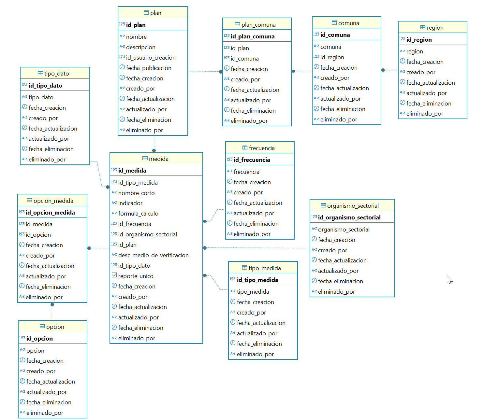
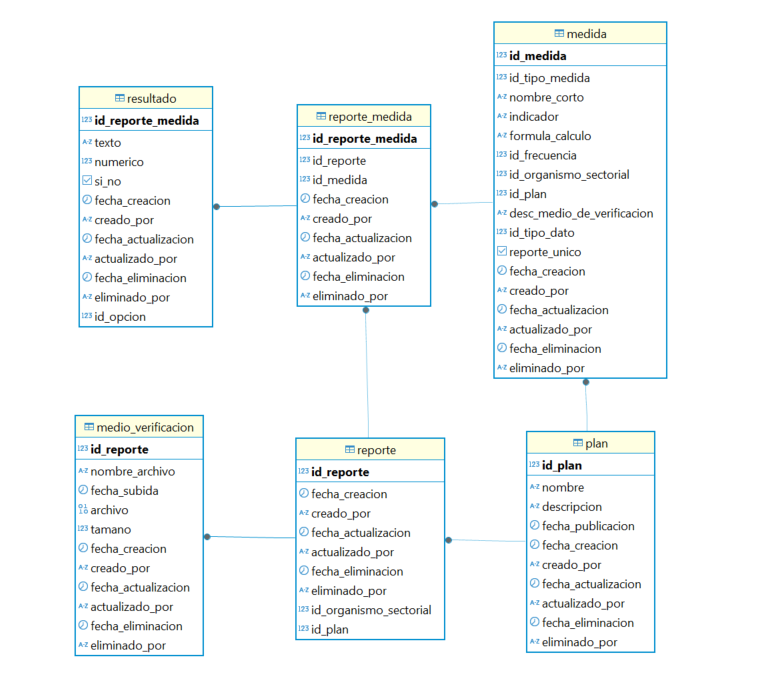
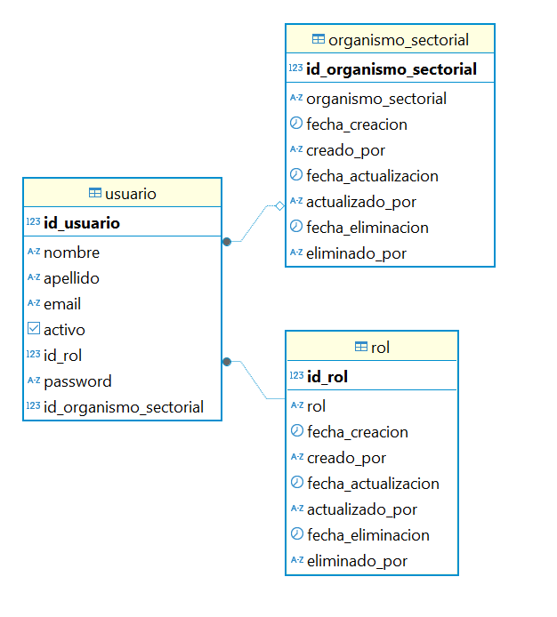

# G3_BackEndPython

API desarrollada en **FastAPI** para permitir el registro de planes de prevención y descontaminación ambiental, así como el registro de reportes de las medidas requeridas por los organismos sectoriales.

## 📌 Requisitos previos
Antes de comenzar, asegúrate de tener instalado:

- **Python** (ver versión requerida en `pyproject.toml`)
- **Poetry** (gestor de dependencias)
- **Uvicorn** (para ejecutar el servidor)
- **PostgreSQL 17.2.3** (base de datos)

## ⚙ Instalación de Poetry
### En macOS:
```sh
brew install pipx
pipx install poetry
```

### En Windows:
```sh
py -m pip install pipx
pipx install poetry==1.8.5
```

## 📦 Instalación de dependencias
Ejecuta el siguiente comando en la raíz del proyecto:
```sh
poetry install
```

⚠ **Nota**: Si hay problemas con la versión de Python detectada por Poetry, usa:
```sh
poetry env use path/to/python.exe
```
Luego, vuelve a instalar las dependencias con `poetry install`.

## 🚀 Ejecutar el proyecto
### Activar el entorno virtual
Si la versión de Poetry instalada tiene el comando `shell`, usa:
```sh
poetry shell
```
Si no está disponible, activa manualmente el entorno virtual con:
```sh
source .venv/bin/activate  # En macOS/Linux
.venv\Scripts\activate     # En Windows
```

### Iniciar el servidor
```sh
uvicorn main:app --reload
```

## 🔄 Manejo de dependencias
Si alguien hace un push con nuevas dependencias y necesitas actualizarlas, ejecuta:
```sh
poetry lock
poetry install
```

## ⚙ Configuración del entorno
Si el archivo `.env` no existe en el directorio del proyecto, créalo con el siguiente contenido:
```ini
APP_TIMEZONE_LOCAL=America/Santiago
DB_DBNAME=
DB_USER=postgres
DB_PASSWORD=
DB_HOST=localhost
DB_PORT=5432
TOKEN_ALGORITHM=HS256
TOKEN_SECRET_KEY=
ACCESS_TOKEN_EXPIRE_MINUTES=30
REFRESH_TOKEN_EXPIRE_DAYS=7
```
**Nota:** Asegúrate de modificar los valores según la configuración de tu base de datos.

## 🗂 Base de Datos
La aplicación utiliza **PostgreSQL 17.2.3** como base de datos.

A continuación, se presentan los diagramas de entidad-relación con los modelos planteados:

##### Diagrama Entidad Relación: PLAN


##### Diagrama Entidad Relación: REPORTE


##### Diagrama Entidad Relación: USUARIO


Para el correcto funcionamiento de la aplicación, se debe montar el siguiente **backup** en la base de datos:

[Descargar Backup](./docs/database/backup/dump-PPDA-202504051144.sql)

⚠ **Nota:** Es necesario restaurar este backup antes de ejecutar la aplicación para garantizar la disponibilidad de los modelos requeridos.

## Estructura del proyecto

```
├──📁 .venv -- Ambiente virtual python
├──📁 db -- Conexión a base de datos, operaciones en db y modelos
│  ├──🗎 ...
├──📁 docs -- Archivos usados en documentacion y diagramas
│  ├──📁 database
│  │  ├──📁 backup -- Archivo para restaurar base de datos
│  │  ├──📁 erd -- Diagramas Entidad-Relación
├──📁 examples -- JSON ejemplos para API (Swagger/OpenAPI)
├──📁 routes -- Rutas a las que responderá el API con su funcionalidad 
│  ├──🗎 ...
├──📁 shared -- Recursos compartidos 
│  ├──🗎 dependencies.py -- Dependencias compartidas (Sesión BD, etc...)
│  ├──🗎 schemas.py -- Modelos Pydantic
│  ├──🗎 utils.py -- Funciones reutilizables
├──🗎 .env -- Archivo de parametrización de variables de ambiente
├──🗎 .gitignore -- Listado de archivos y carpetas que se ignoraran en el repositorio
├──🗎 config.py -- Lee y disponibiliza variables de ambiente
├──🗎 main.py -- Punto de entrada de la aplicación
├──🗎 poetry.lock -- Detalle dependencias instaladas
├──🗎 pyproject.toml -- Archivo de gestión de dependencias
├──🗎 README.md -- Documentacion del repositorio
```

## 👥🔑 Roles de usuario y permisos


### 1. Administrador: 
Equivalente a un super admin, tiene permiso para aplicar cualquier método 👁️✍️🔄🗑️ en todos los endpoints (Ver documentación en Swagger).

Credenciales para probar este rol:
Usuario
``` PENDIENTE```
Contraseña
```123456```

### 2. Fiscalizador : 
Es el usuario de la SMA que tiene acceso a los siguientes endpoints métodos y endpoints

Credenciales para probar este rol:
Usuario
``` PENDIENTE```
Contraseña
```123456```

*   **Regiones:**👁️ `GET` (Listar todas y obtener por ID).
*   **Comunas:**👁️ `GET` (Listar todas y obtener por ID).
*   **Planes:**👁️ `GET` (Listar todos y obtener por ID).
*   **Frecuencias:**👁️ `GET` (Listar todas y obtener por ID).
*   **Tipos de Medidas:**👁️ `GET` (Listar todos y obtener por ID).
*   **Tipos de Datos:**👁️ `GET` (Listar todos y obtener por ID).
*   **Opciones:**👁️ `GET` (Listar todas y obtener por ID).
*   **Medidas:**👁️ `GET` (Listar todas y obtener por ID).
*   **Vinculación Medida-Opción:**👁️ `GET` (Listar opciones asociadas a cualquier medida).
*   **Reportes:**👁️ `GET` (Listar todos los reportes y obtener por ID).
*   **Medios de Verificación:**👁️ `GET` (Listar todos los medios de verificación y obtener por ID).

*   ❌Nota: No tiene acceso a la gestión de Usuarios.

### 3. Organismo Sectorial: 
Es el usuario perteneciente a algún organismo sectorial que tiene acceso a los siguientes métodos y endpoints

Credenciales para probar este rol:
Usuario
``` PENDIENTE ```
Contraseña
```123456```

*   **Regiones:**👁️ `GET` (Listar todas y obtener por ID).
*   **Comunas:**👁️ `GET` (Listar y obtener por ID, *filtrado automáticamente para mostrar solo comunas pertenecientes a planes con medidas que el organismo debe reportar*).
*   **Planes:**👁️ `GET` (Listar y obtener por ID, *filtrado automáticamente para mostrar solo planes que contienen medidas que el organismo debe reportar*).
*   **Frecuencias:**👁️ `GET` (Listar todas y obtener por ID).
*   **Tipos de Medidas:**👁️ `GET` (Listar todos y obtener por ID).
*   **Tipos de Datos:**👁️ `GET` (Listar todos y obtener por ID).
*   **Opciones:**👁️ `GET` (Listar todas y obtener por ID).
*   **Medidas:**👁️ `GET` (Listar y obtener por ID, *filtrado automáticamente para mostrar solo las medidas que el organismo debe reportar*).
*   **Vinculación Medida-Opción:**👁️ `GET` (Listar opciones asociadas a una medida, *solo si la medida es una que el organismo debe reportar*).
*   **Reportes:**
    *  👁️ `GET`: Listar y obtener por ID (*solo los reportes creados por su organismo*).
    *  ✍️ `POST`: Crear nuevos reportes (*para su organismo*).
    *  🔄 `PUT`: Actualizar reportes existentes (*solo los propios*).
    *  🗑️ `DELETE`: Eliminar reportes (*solo los propios*).
*   **Medios de Verificación:**
    *  👁️ `GET`: Listar y obtener por ID (*solo los asociados a medidas/reportes de su organismo*).
    *  ✍️ `POST`: Crear nuevos medios de verificación (*para sus reportes*).
    *  🔄 `PUT`: Actualizar medios de verificación existentes (*solo los propios*).
    *  🗑️ `DELETE`: Eliminar medios de verificación (*solo los propios*).

*   ❌Nota: No tiene acceso a la gestión de Usuarios ni a la gestión directa de Regiones, Comunas, Frecuencias, Tipos, Opciones o Medidas más allá de la lectura filtrada.